

  

# Overview

The TrustworthySearch API is an efficient
risk analysis service for analyzing autonomous vehicle (AV)
technologies. The service acts as an optimization layer on top of
simulation by choosing which scenarios to run, providing statistical
coverage over failure modes, and prioritizing failures by likelihood.
Our algorithms efficiently generate useful data and
actionable insights regarding safety. Most importantly,
TrustworthySearch interacts with AV systems in a black-box manner,
preserving the integrity and confidentiality of the software under test.

# Getting started

This code provides an example of a client which acts as a broker to
local simulation workers. The broker receives jobs from the search
server, load balances amongst workers, and then sends results back to
the search server asynchronously.

This demo is designed for small-scale experimentation to see how the
TrustworthySearch API works. The server it communicates with at
<https://trial.trustworthy.ai> contains limited versions of our search algorithms and will cap jobs at 100 simulations. Note: this is solely an API endpoint and will not show anything useful if you visit it in a regular browser. 

The code in the `python` folder is designed for python3. The following is a brief overview of
the contents (see individual files for full documentation):

-   `demo.pdf` contains an illustration of how integration of the TrustworthySearch API works. It shows a visualization of using
    simple communication (no broker) as well as brokered communication
    to solve the problem.

-   `requirements.txt` contains all of the 3rd-party python packages needed.

-   `trustworthy_search.proto` defines the message types used for
    communication between search server and broker, as well as between
    broker and simulation worker.

-   `python/run_codegen.py` compiles the `trustworthy_search.proto` file into
    python code.

-   `python/broker.py` implements a load balancing broker.

-   `python/worker.py` implements simple simulation workers that communicate
    locally with brokers.

-   `python/job_killer.py` allows you to kill jobs early.

In addition to these files, you will also need `trial_server.crt`, which is the certificate file used to communicate with
    the demo server. You can get this at <https://trustworthy.ai/docs/demo/trial_server.crt>. To run the python code as-is, download and place this file in the `python` folder.

# Running the demo

To run the demo, follow these steps. If you have trouble, email
support@trustworthy.ai.

0.  `pip3 install -r requirements.txt` to install the relevant 3rd party packages.

1.  `cd python` to navigate to the `python` directory

2.  `python3 run_codegen.py` to compile the protobuf file

3.  Open 2 terminal windows or tabs.

4.  `python3 worker.py`
    in the first terminal. This will start 10 simulation workers. These simulation workers currently  compute a simple function of the input parameters - the output of the simulation is the minimum value among these parameters. Feel free to change this function to whatever you want (line 68 of `worker.py`).

5.  `python3 broker.py --port 5000`
    in the second terminal. This will start a job where the server tells
    the broker which simulations to run, and the broker distributes
    these jobs amongst workers.

    Optionally, run multiple brokers at the same time by starting new
    brokers with different port arguments, *e.g.* `python3 broker.py --port 5001`

    Since the brokers and workers are running locally on your machine
    for this demo, the brokers need to have unique port numbers so that
    the workers can distinguish between them properly.

    If you get a “Name resolution failure” error, run
    `pip3 install -r requirements.txt –-upgrade`

6.  Ctrl-c `worker.py` when the job is complete. If you want to kill a
    job early you should send a KillJob request to the server by running

    `python3 job_killer.py --jobid JOB_ID`

    Running Ctrl-c on `broker.py` is not recommended as it will not
    result in the job actually being killed on the server.

When running `worker.py`, `broker.py`, or `job_killer.py`, add `--help` or `-h` to see a detailed list of options.
    
# Search modes

The demo includes 4 different search modes: `GRID`, `STRESSTEST`, `MONTECARLO`, and `RISK`. To run the demo with any of these choices, just type ``python3 broker.py --port 5000 --job_type [TYPE]``, where `[TYPE]` is one of the 4 choices.

We'll talk about each of their merits below and dicuss when you should use them. Before diving into the details, here are 4 rules of thumb:

* `GRID` and `STRESSTEST` are best used for uniform distributions over the search space, whereas `MONTECARLO` and `RISK` should be used when you have a non-uniform distribution over the search space.
* `GRID` and `MONTECARLO` are best suited for low-dimensional settings or when the probability of the region of interest is high. `STRESSTEST` and `RISK` are better suited for high-dimensional settings and/or when finding the region of interest is hard.
* `STRESSTEST` and `RISK` are adaptive methods: they use the previous samples to inform where to search next. `GRID` and `MONTECARLO` are not adaptive: the parameter locations are chosen at the start of the job.
* `STRESSTEST` is good at finding single worst-case points of failure but is not at getting coverage over failure modes. `RISK` is good at finding coverage of all failure modes and prioritizes finding high-likelihood failure modes over less likely ones.

---

Now let's dive into each of the search modes. As a running example, we'll consider a 2-dimensional function that will act as the output of a simulation: `f(x)=max(min(x_1,x_2), min(-x_1,x_2))`, where `x_1` and `x_2` are the first and second components of the vector of parameters `x`. Our goal will be to find regions such that this function is greater than 2 (the pink region in the figure below).

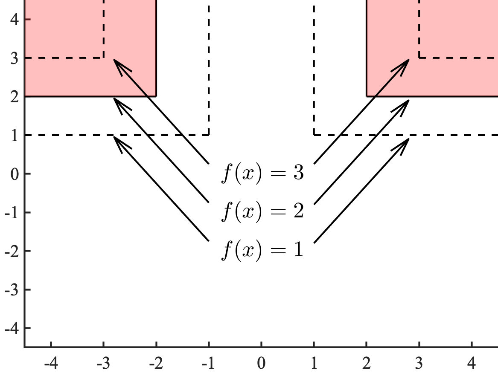
In a real situation when you use this API, you won't know what the function looks like beforehand (and you will probably have more than 2 parameters to search over), but in this case we know the ground truth and can draw the level sets of this function (see the image on the right).
  
  
  
  
  
  

---

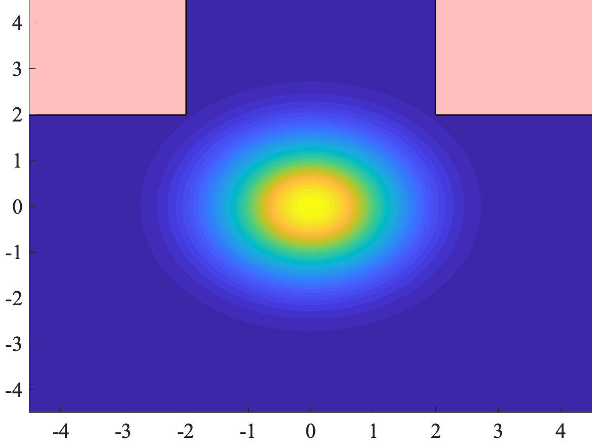
We consider two different types of distributions for the parameters. The first is a uniform distribution, where both `x_1` and `x_2` take values uniformly between -4 and 4. The second is a Gaussian distribution, where `x_1` and `x_2` are both distributed like standard Gaussians (with mean 0 and variance 1). In the latter case, we can visualize the contours of the distribution, with the region of interest overlaid (see righthand image). The yellow regions have high likelihood, and the blue regions have low likelihood. As you can see, the region of interest (`f(x)>2`) is relatively rare: it has a probability of about 1 in 1000.
  
  
  

For all the modes, we use 625 samples in order to provide a fair comparison. Note that the demo API is limited to only 100 samples so you shouldn't expect to replicate these plots exactly (contact us at support@trustworthy.ai to learn about licensing details). The samples in the following examples are plotted in the order that they are drawn (earlier samples in blue, later samples in yellow).

## Grid-search

Grid-search (the `GRID` job type) places a regular lattice over the points in the parameter space. When the parameters have uniform distributions (left image below), this is a pretty standard grid like we usually think of it. When the parameters are not uniformly distributed, however, `GRID` has the interpretation of carving the parameter space into regions of *equal probability* (right image below).

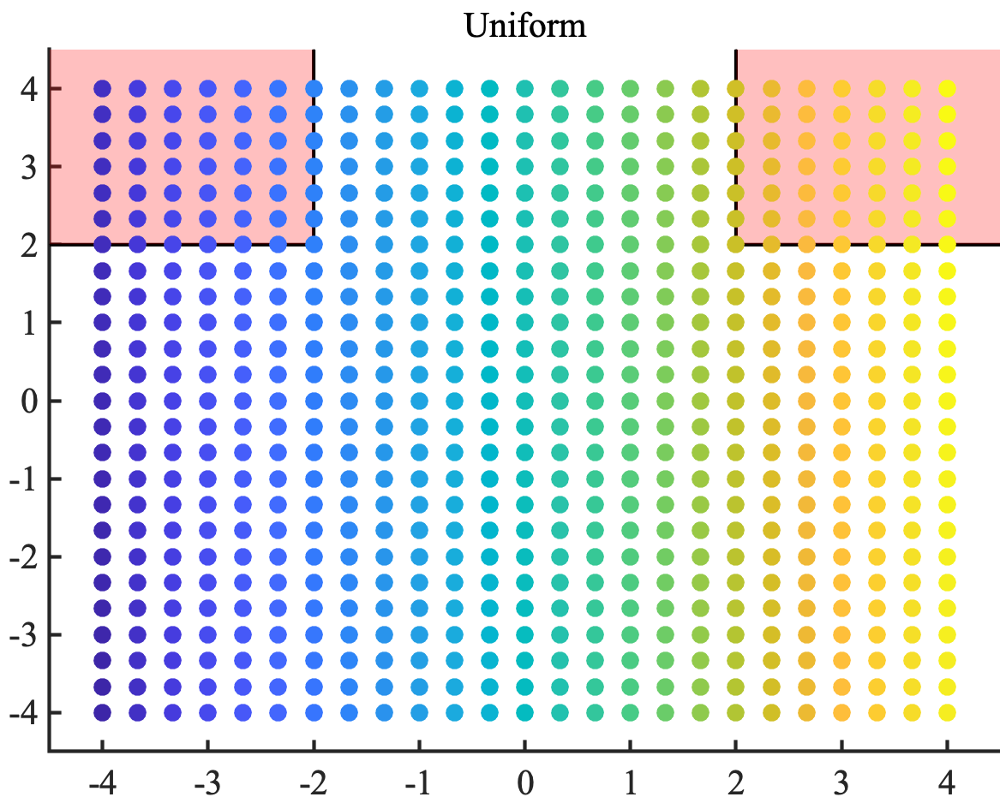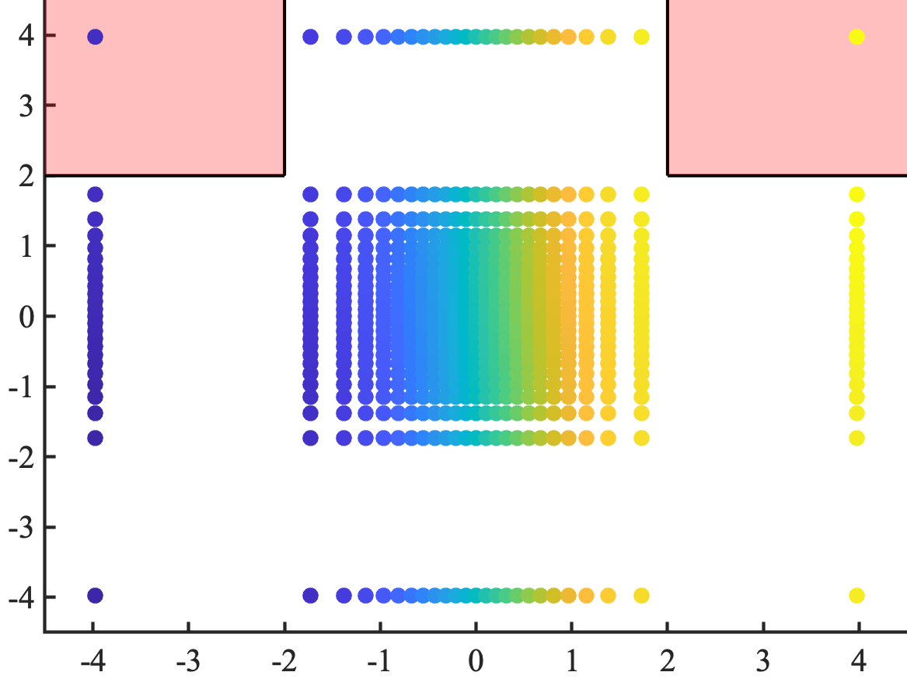
  
  
  
  
  
  
  

Don't be fooled by how well grid-search does on the left image. The number of samples grid-search needs to get good coverage of failure modes is exponential in the dimension (if we need 10 grid locations along each dimension, that's 10^dimension samples total). Grid-search is well suited for getting coverage in uniform parameter spaces that are low dimensional. 

The right-hand image shows how regions of equal probability spread out as we get into the tail regions of the Gaussian distribution. If this seems sort of like doing "derandomized" Monte Carlo search, you're right. When the probability is small and failures are hard to find, you're better off using `RISK` if you want coverage of failure modes. If you're interested in just finding a single point of interest (but not necessarily getting coverage of all modes), `STRESSTEST` is a suitable method.

## Monte Carlo
Monte Carlo (the `MONTECARLO` job type) draws points randomly from the distribution of parameters. When the parameters are uniformly distributed, regions of equal area have equal probability of having a sample landing within them. When the distribution is not uniform, regions of equal probability need not have equal area. From a certain perspective, you can think of Monte Carlo as sort of like doing a "randomized" version of grid-search (just as grid-search is like a "derandomized" Monte Carlo). 

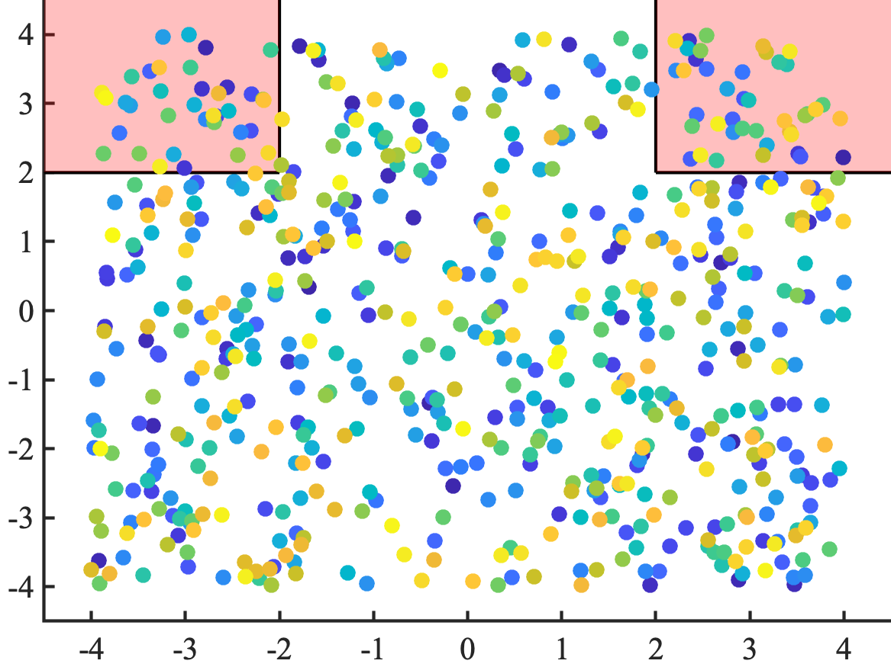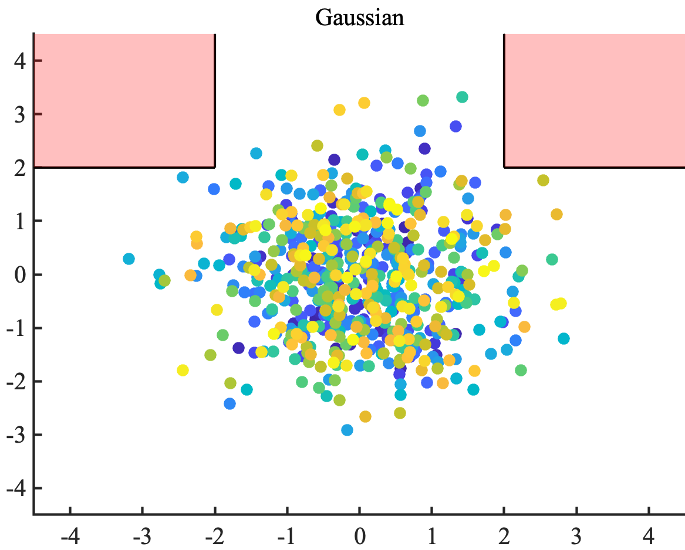
  
  
  
  
  
  
  

As you can see in the images above, Monte Carlo does well (just like grid-search) in the uniform example (the left image). But when the probability of the region of interest gets small (the right image), it doesn't find any samples. This is expected behavior - with 625 samples, we are unlikely to have even one to land within a region that has probability of 1/1000. `RISK` is better at efficiently getting coverage of failure mdoes when the probability is rare, and `STRESSTEST` is better at efficiently finding single instances of failure.

## Stress-testing

Stress-testing (the `STRESSTEST` job type) is all about finding worst-case failures (in this example, finding parameters `x` that maximize `f(x)`). In some communities, this is also called black-box optimization. This is an adaptive method, because we use information from previous samples to inform where we search next. Unlike the `RISK` job type, stress-testing doesn't care about the likelihoods of points. It only cares about optimizing the function. 

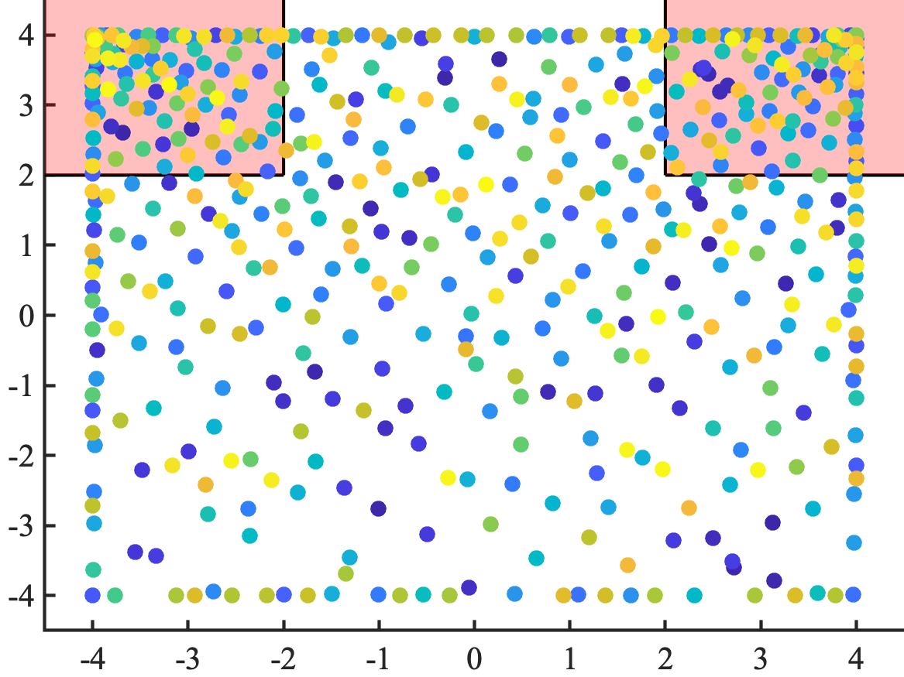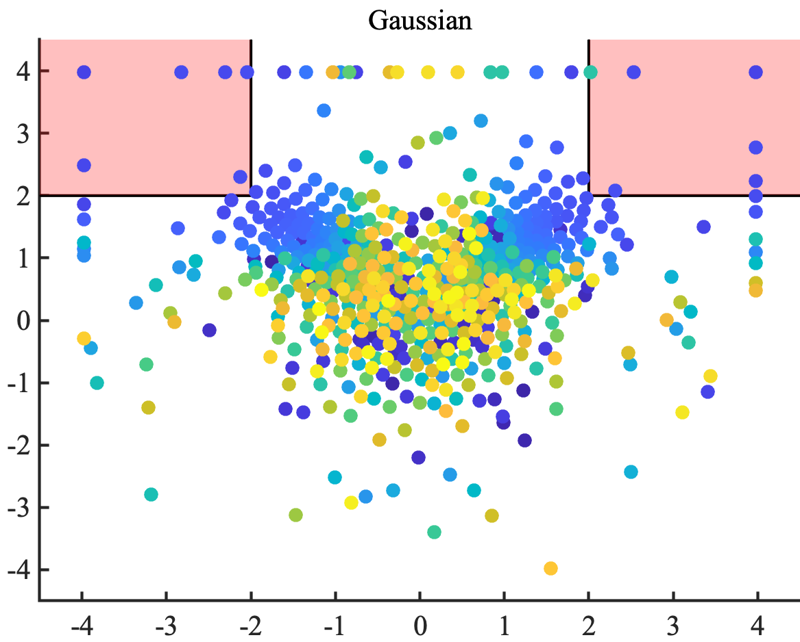
  
  
  
  
  
  
  

The adaptivity part of the method may be hard to understand based on looking at the colors of the points, so let's explain what's going on. Stress-testing tries to hunt for points that optimize the function (in this case that means maximize). So, after finding a region that has high function value, it will stay away from points in that neighborhood and instead go off to a far away place to hunt for new maxima. The size of these neighborhoods will decrease as it gets a better understanding of the whole parameter space and it will often come back to various regions as it refines its knowledge of the function. This is why yellow points and blue points are somehwat scattered around the whole parameter space. This fact is also  why you can think of this approach as being like adaptive grid-search.

As with grid-search, this method performs much better on the uniform case (lefthand image) compared to the Gaussian case (righthand image). The reason for this is basically that for non-uniform distributions, stress-testing uses a warped grid (like the righthand image in the grid-search section above) to calculate neighborhoods of points. So light-tailed regions like the pink region of interest in the righthand image get low coverage, since points that look far apart to us in this region are actually really close together in the warped grid. That is also why there are no yellow points inside the pink region of interest in the righthand image: the algorithm hasn't yet reached a small enough size for the neighborhoods it cares about (with the alotted budget of 625 samples) that warrants going back into the pink regions. On the other hand, you can see that there are a lot of yellow points clustered around `(-4,4)` and `(4,4)` in the lefthand image. This is because those regions have the highest function value and the neighborhood size (in the uniform spacing) warrants extra exploration in those regions. 

## Risk

At a high level, the `RISK` job type is essentially an adaptive form of Monte Carlo. The goal is to find coverage of all regions of interest so that we can report back the probability of those regions. The adaptivity comes into play when we use previous evaluations to inform where we sample next (unlike standard Monte Carlo or grid-search which are both nonadaptive). Unlike stress-testing (which is also adaptive), the algorithm underlying `RISK` keeps track of likelihoods of parameters while iteratively choosing the next sampling points. If this sounds like it's harder than any of the other 3 modes, that's because it is. But there's a great outcome from doing this bookkeeping. Namely, when the algorithm is finished (i.e. we've found coverage of the regions of interest), we can actually report back the probabilities of *all levels* before this region as well. For this example, that means that we can report the probability that `f(x)>L` for any `L<=2` when the job is finished.

Here are a few other ways to think about what this method is doing: just like we can think of grid-search in non-uniform spaces as carving up the parameter space into regions of known probabilities, we can think of this risk approach as carving up the *output space* into regions of known probabilities. Further, we can think of this risk method as doing black-box estimation, a counterpart to stress-testing which does black-box optimization. Estimation is all about coverage of probability and keeping track of likelihoods, whereas optimization is all about just finding any point in the region of interest.

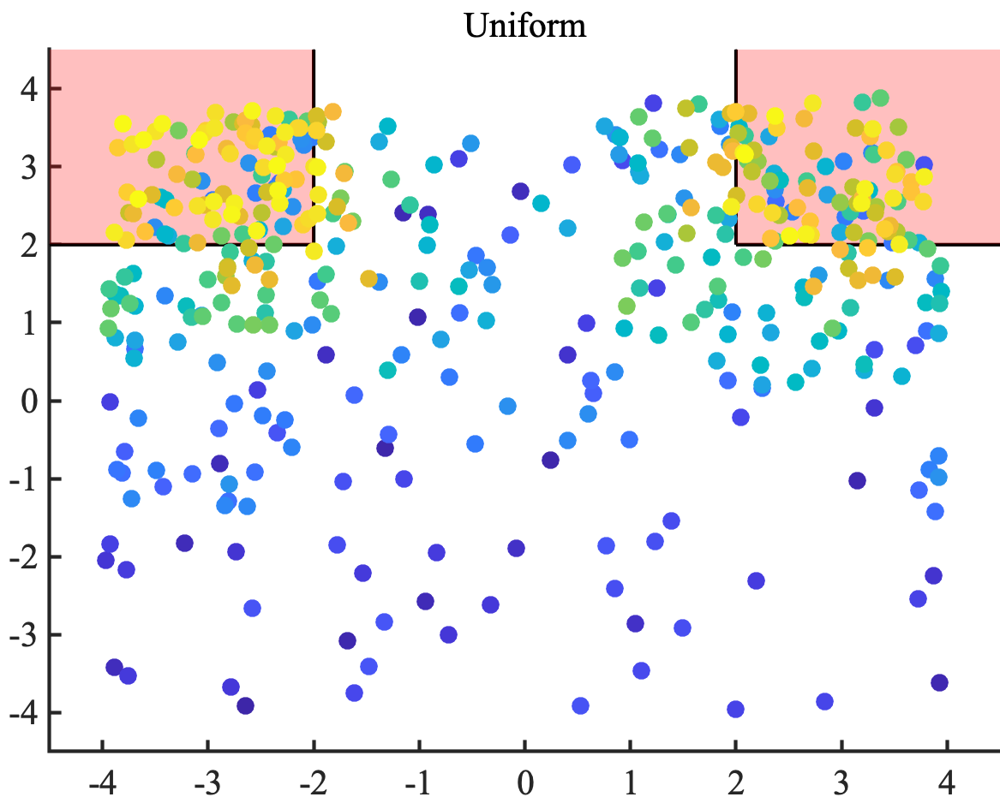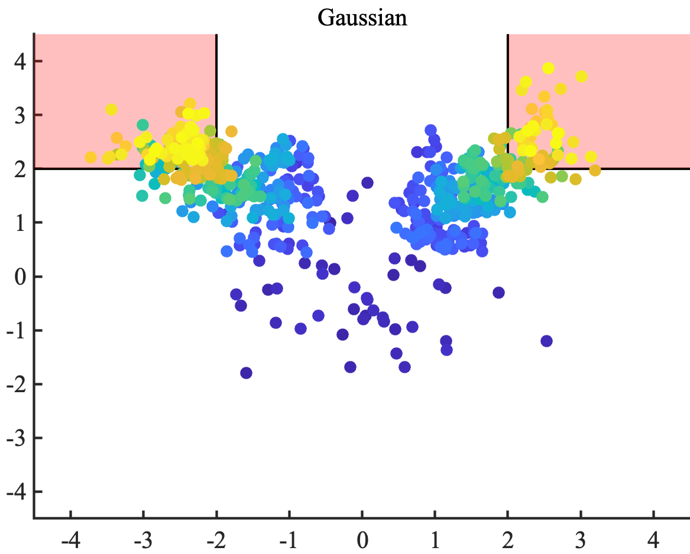
  
  
  
  
  
  
  

You can see the adaptivity of the method in both pictures pretty clearly. The order of sampling follows the growth of `f(x)` so that all of the yellow points are at large function values inside or near the region of interest. Comparing with Monte Carlo, we see that all of this fancy work was useful but not game-changing for the lefthand picture (uniform distribution), as the region of interest is pretty common (it has probability 0.125). The righthand picture (Gaussian distribution) is a completely different story. Here, we see that the algorithm finishes with clusters of points concentrated at the high-likelihood spots inside the region of interest (near the corners closest to the origin). It turns out we're able to estimate the probability of `f(x)>2` with error bars smaller than 0.0005 with this sampling budget.

Compared with stress-testing, we see that `RISK` prioritzies coverage over simply finding any point that minimizes `f(x)`. What this actually means is that this method samples locations of relatively high likelhood within the region of interest (and even before getting to the region of interest). For the uniform case on the left, this means finding the pink region and then trying to sample as much area as possible within the pink region. In the Gaussian case, this means exploring neighborhoods of the corners near `(-2,2)` and `(2,2)` within the pink region.

    
# Creating a Scenario
A detailed discussion of the scenario-authoring process can be accessed at <https://trustworthy.ai/docs/demo/integration_guide.pdf>. In this document, we walk through using the TrustwortySearch API to test an actual AV algorithm in a driving scenario. This includes figuring out what parameters to search over and what function or risk metric to use to guide the search (see the checklist below for an overview of the steps involved). Here's an example diagram of what might go into creating a scenario specification (see the linked document for more details).

  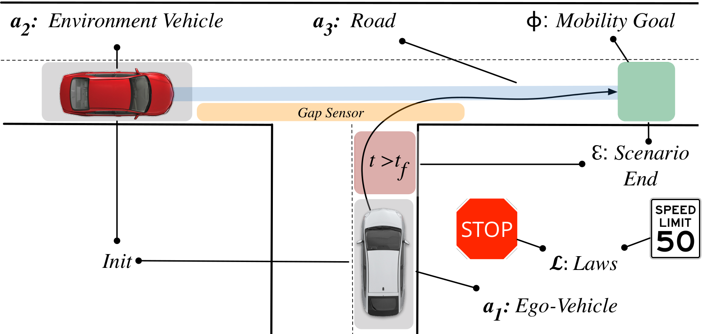

## Checklist
At a high-level the basic steps in integrating TrustworthySearch are as follows:

* [ ] Determine base scenario *e.g.* unprotected left at a T-junction

* [ ] Determine whether the simulation is pre- or post-perception

* [ ] Identify if the scenario execution is deterministic

* [ ] Determine environment-vehicle parameterizations

* [ ] Write scenario parameterization as a list of random variables

* [ ] Decide on a set of laws which describe the specification

* [ ] Identify any laws which have binary semantics

* [ ] Determine the metric(s) that will be used to score simulations

* [ ] Determine exit conditions and how they will affect the satisfaction of
  the specification

* [ ] Determine a rough estimate of the failure probability to estimate of the
  computational resources that will be necessary for full evaluation

* [ ] Integrate TrustworthySearch API with your current simulation stack by
  building upon this demo code

## Feature Roadmap
The example integration in this demo of a broker communicating with local workers is pretty simple. It's also straightforward to extend the broker/worker pair to include fault tolerance or utilize pre-packaged scaling solutions such as Ray. Example scenarios and integrations with existing AV systems/simulators (*e.g.* OpenPilot, Autoware, Carla, and LGSVL) are coming soon or available upon request (contact support@trustworthy.ai for more info). You can also read about how we tested OpenPilot in CARLA at this link: [https://arxiv.org/abs/1912.03618](https://arxiv.org/abs/1912.03618).
